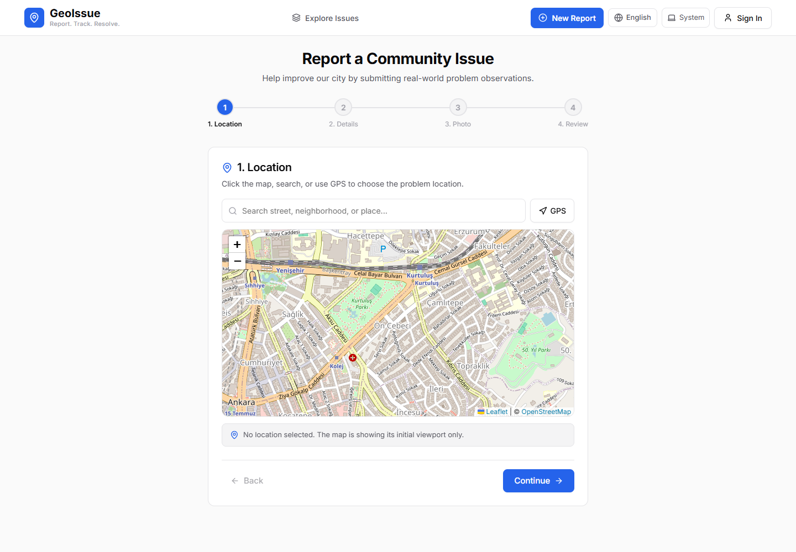

# GeoIssue

GeoIssue is a simple civic app for reporting local problems such as potholes,
street-light failures, water leaks, and traffic issues.

Users choose a location on the map, describe the problem, and follow its status.
Reports are stored in PostgreSQL and served through a Node.js API.

The active reporting area is Istanbul. Map pins show status: yellow for submitted
or under review, blue for accepted, red for in progress, and green for resolved.
Priority is calculated from supporters: Low (0-1), Medium (2-4), High (5-9), and
Urgent (10+).



## Built with

- React and Vite
- Node.js and Express
- PostgreSQL
- Leaflet and OpenStreetMap
- Docker and WSL support

## Run locally

```bash
npm ci --prefix server
npm ci --prefix client
docker compose up -d postgres
npm run migrate --prefix server
npm run seed:dev --prefix server
npm run dev
```

Open `http://localhost:5173`.

For local development, keep `VITE_API_URL=/api`; Vite proxies it to the server,
avoiding browser CORS failures. Email/password authentication is local by default.
Google sign-in stays hidden unless both Firebase client variables and Firebase
Admin credentials on the server are configured, then
`VITE_GOOGLE_AUTH_PROVIDER=firebase` can be set.

Keep local `.env` files private. For architecture, API details, database notes,
authentication, deployment, and the study guide, see
[`docs/project/README.md`](docs/project/README.md).
