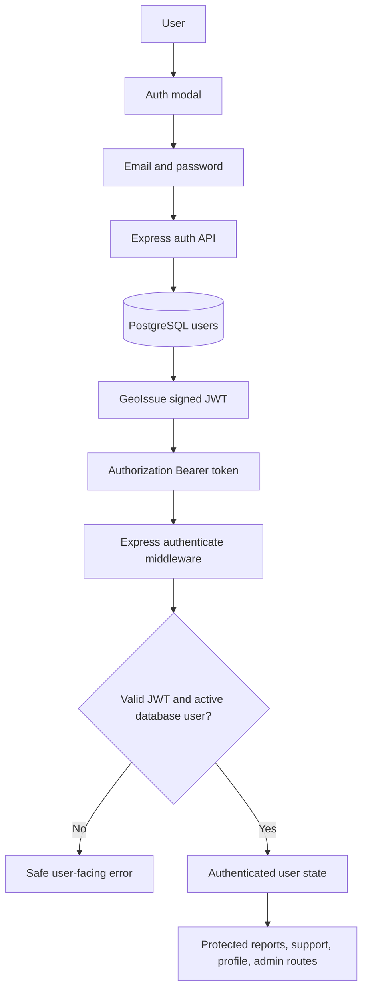
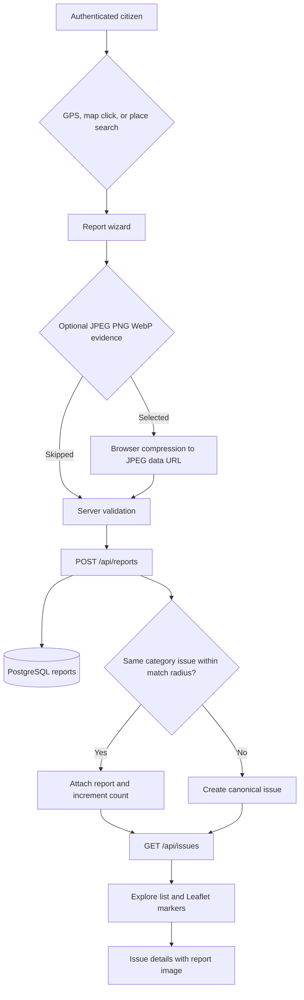

# Current Core Flow

This document describes the code and local development flow as implemented. It does not claim production deployment readiness.

## Authentication

- Email/password accounts use a versioned scrypt password hash and a seven-day signed JWT. Valid legacy PBKDF2 hashes are upgraded after successful login.
- The token is stored in `localStorage`, sent as `Authorization: Bearer <token>`, and cleared with React Query data on logout.
- Auth state restores with `/api/auth/me`; the admin route waits for auth restoration before deciding access.
- The API reloads the current database user for every authenticated request, so role/status changes take effect without trusting JWT role claims.

## Report, image, and issue flow

- GPS requests high accuracy, displays returned accuracy as a radius, and exposes permission-denied, unavailable, timeout, and unsupported-browser messages. Map click remains available.
- Image references are checked on both client and API. Supported data URLs must have a JPEG, PNG, or WebP signature; direct links must be HTTP(S).
- `Issue` is canonical. Multiple `Report` rows can support one issue.

## Data and map behavior

- `GET /api/issues` supplies both Explore cards and Leaflet markers. Explore retrieves all paginated issue pages, then Leaflet fits valid issue coordinates.
- Map/list toggling preserves filters and search. Leaflet resize handling updates hidden-to-visible maps and transition animation is disabled to avoid removed-map errors.
- `/api/health` reports `database: postgresql` or `database: memory`. Without a reachable `DATABASE_URL`, the API intentionally uses temporary memory data.

## Development database fixtures

1. Start PostgreSQL: `docker compose up -d postgres`.
2. Run schema/migration: `npm --prefix server run migrate`.
3. Load repeatable realistic fixtures: `npm --prefix server run seed:dev`.

`seed:dev` is blocked in production and requires `DATABASE_URL`. It creates 30 issues and reports across six existing categories, six statuses, coordinates around Istanbul, and three development residents. It is idempotent by fixture IDs and moves legacy out-of-city records to Istanbul.

## Verification record — 2026-09-09

| Area | Evidence | Result |
|---|---|---|
| PostgreSQL email auth, refresh, logout, re-login | Real browser flow and protected `/api/auth/me` | PASS |
| PostgreSQL data | health reported PostgreSQL; identity-column migration preserved row counts | PASS |
| Backup/restore | Fresh custom-format dump restored into isolated PostgreSQL 16 container with matching counts | PASS |
| Explore/map | Real API issue cards and Leaflet markers loaded in browser | PASS |
| GPS | Simulated high-accuracy result, denied, unavailable, timeout, and manual selection | PASS |
| Image persistence | JPEG data URL submitted with HTTP 201, displayed after refresh, confirmed in PostgreSQL | PASS |
| Responsive layout | 128 checks across 16 widths and 8 screens; no overflow after fixes | PASS |
| Build/tests | server/client production build; 48 Vitest tests | PASS |

Cloud URLs and physical-device GPS remain unverified until the cost-gated deployment is approved and created.
